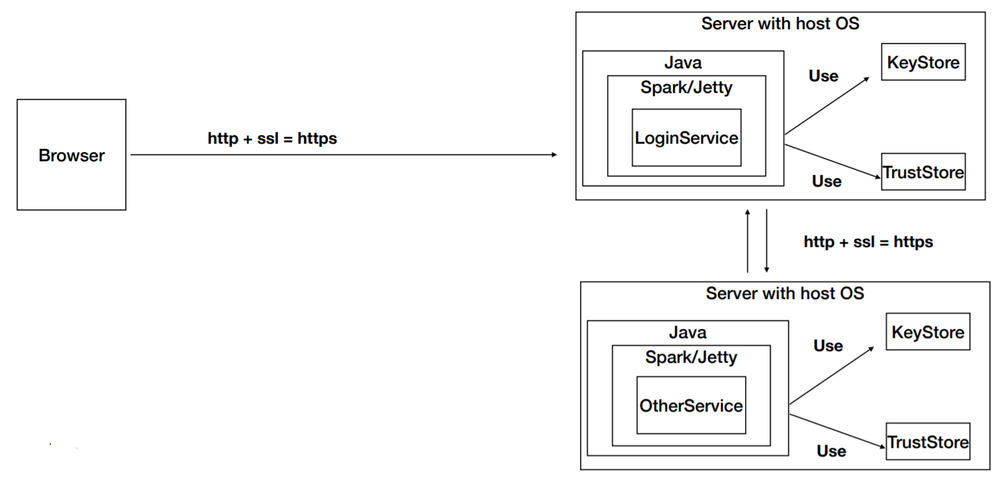
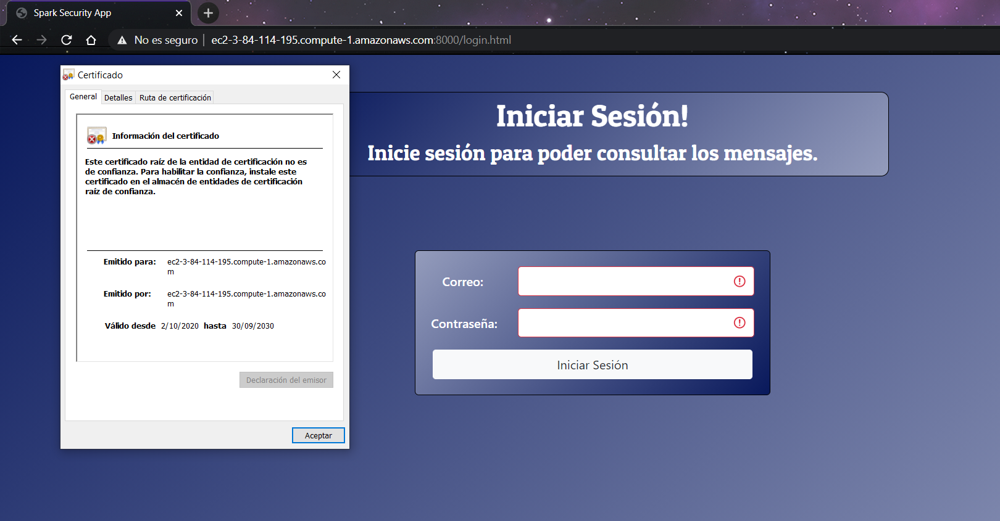
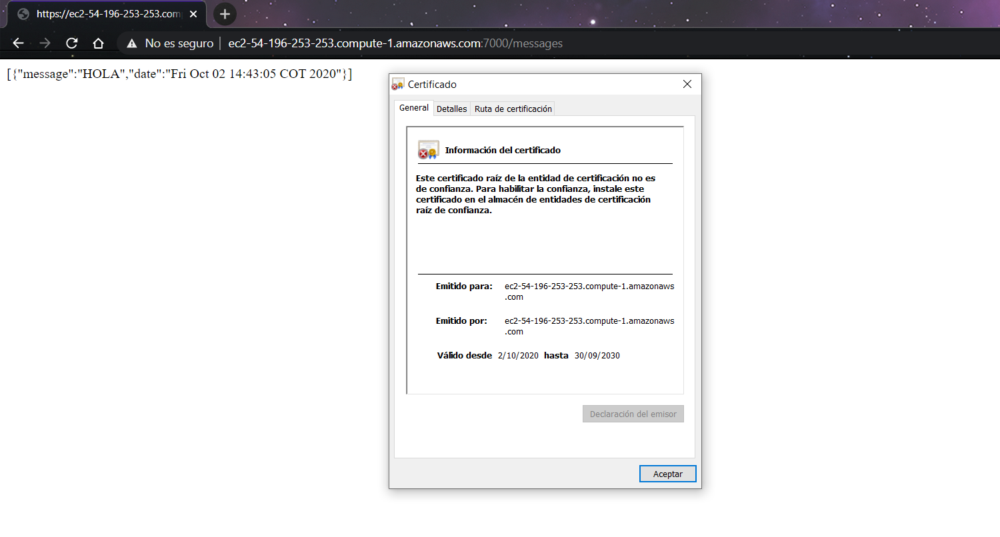
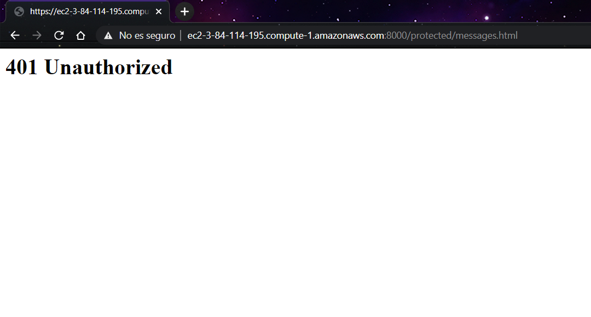
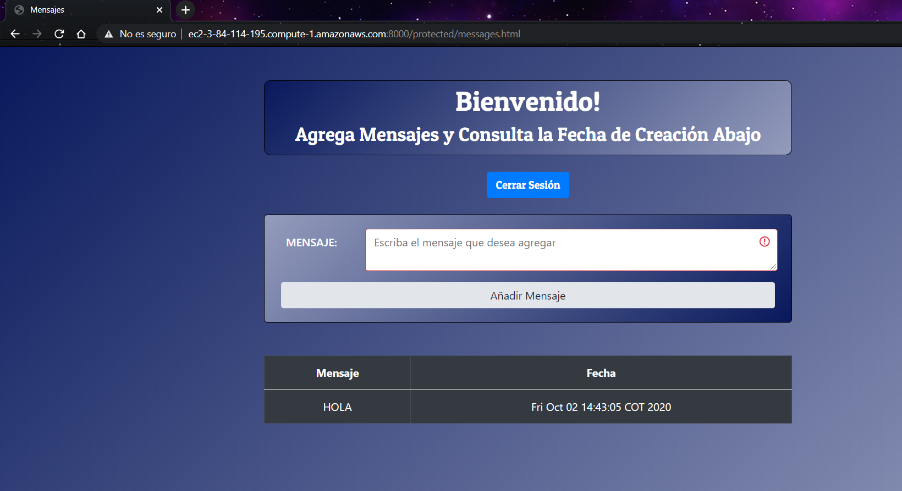
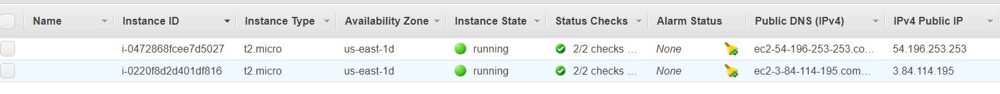

# AREP-SecureSparkWebApp

## Resumen
El objetivo de este laboratorio es implementar un aplicativo web que se conecte de manera segura mediante HTTPS a otro aplicativo sólo si se logran la autenticación por parte de un usuario, para ello usaremos el framework de Spark para java.

Para efectos prácticos, se utilizó contenedores en docker para facilitar su despliegue en AWS.

Crearemos dos repositorio en DockerHub y subiremos las imagenes de los dos proyectos a los repositorios.
Finalmente crearemos dos máquinas virtuales en AWS, instalaremos Docker y desplegaremos los contenedores creados anteriormente para poder utilizar el aplicativo web y verificar que se logran comunicar de manera segura mediante HTTPS:

La arquitectura descrita anteriormente se puede ver en la siguiente imagen.



## SecureSparkServiceApp (Login Server)
El proyecto se encuentra disponible [aquí](https://github.com/JohannPaez/AREP-SecureSparkServiceApp).
#### Integración Continua
[](https://circleci.com/gh/JohannPaez/AREP-SecureSparkServiceApp)

## SparkServiceApp (Functional Server)
El proyecto se encuentra disponible [aquí](https://github.com/JohannPaez/AREP-SparkServiceApp).
#### Integración Continua
[](https://circleci.com/gh/JohannPaez/AREP-SparkServiceApp)

   
 ## Prerequisitos
 Tener instalado:
 - Java.
 - Maven.
 - Docker.
 
 Entender sobre peticiones http, docker (contenedores), servidores y demás, así como el lenguaje JAVA en el que fue realizado este proyecto.
 
 ## Comandos 
  Para compilar y correr las pruebas: ```mvn package```
  
  Para ejecutar y utilizar los aplicativos: ```mvn exec:java -Dexec.mainClass="com.arep.SparkWebServer"```
  
  Para generar javadoc con maven: ```mvn javadoc:javadoc```
  
  Para generar javadoc de las pruebas: ```mvn javadoc:test-javadoc```
  
  **IMPORTANTE:** Para poder utilizar el aplicativo es necesario compilar primero el proyecto con **mvn package**.
 
 ## ¿Cómo usar el aplicativo?
 Descargue o clone el repositorio con el siguiente comando.
 
    git clone https://github.com/JohannPaez/AREP-SecureSparkWebApp.git
    
Acceda a los proyectos SecureSparkServiceApp y SparkServiceApp y compile cada proyecto con el comando.

    mvn package

### Dentro del proyecto SecureSparkServiceApp

Si quiere correr el proyecto sin docker, utilice el siguiente comando:

    mvn exec:java -Dexec.mainClass="com.arep.SparkWebServer"
    
Si quiere correr el proyecto con docker, utilice los siguientes comandos para construir la imagen y correr localmente o en una máquina virtual:

    docker build -t najoh2907/securesparkserviceapp .
    
    docker run -dp port_machine:port_container -e HOSTPORT="ip_other_machine"+ ":" + "port_other_machine" najoh2907/securesparkserviceapp
    
**Importante**: Si sólo deseas utilizar el aplicativo, puedes hacerlo accediendo al siguiente enlace:
- https://ec2-3-84-114-195.compute-1.amazonaws.com:8000/.

**Repositorio Docker**: El repositorio de Docker se encuentra disponible en:
- https://hub.docker.com/r/najoh2907/securesparkserviceapp.


### Dentro del proyecto SparkServiceApp

Si quiere correr el proyecto sin docker, utilice el siguiente comando:

    mvn exec:java -Dexec.mainClass="com.arep.SparkWebServer"
    
Si quiere correr el proyecto con docker, utilice los siguientes comandos para construir la imagen y correr localmente o en una máquina virtual:

    docker build -t najoh2907/sparkserviceapp .
    
    docker run -dp port_machine:port_container najoh2907/sparkserviceapp
                           
**Importante**: Si sólo deseas utilizar el aplicativo, puedes hacerlo accediendo al siguiente enlace:
- https://ec2-54-196-253-253.compute-1.amazonaws.com:7000/messages.

**Repositorio Docker**: El repositorio de Docker se encuentra disponible en:
- https://hub.docker.com/r/najoh2907/sparkserviceapp.

 ## EndPoints Disponibles 
 
### Proyecto SecureSparkServiceApp

- **GET**:

  - **/login.html**: Archivo de inicio de sesión estático.

  - **/protected/messages.html**: Archivo de mensajes estático (requiere autenticación).

  - **/protected/messages**: Mensajes del servidor funcional (requiere autenticación).

  - **/isLogin**: Muestra si el usuario está logeado.

  - **/protected/logout**: Cierra sesión para el usuario.

- **POST**:

  - **/login**: Inicia sesión para el usuario.

  - **/protected/messages**: Añade un mensajes al servidor funcional (requiere autenticación).


### Proyecto SparkServiceApp

- **GET**:

  - **/service**: Servicio de respuesta rápida del servidor. 

  - **/messages**: Muestra los mensajes del servidor.

- **POST**:

  - **/messages**: Añade un mensaje del servidor.


## Pruebas


### Máquinas en AWS

Certificado del servidor de login.



Certificado del servidor funcional.



Respuesta del servidor para usuarios no autenticados.



Conexión con el servidor funcional para usuarios autenticados.



Instancias de ejecución en AWS.



## Video Demostrativo

El video demostrativo de la conexión segura mediante HTTPS, está disponible en:

- https://www.youtube.com/watch?v=6_sQU8FxU3M&ab_channel=SebastianP%C3%A1ez.


## Construido con

- [Maven](https://maven.apache.org/) Administrador de dependencias.

- [Docker](https://www.docker.com/) Administrador de contenedores.

- [Spark](http://sparkjava.com/) Framework para desarrollar aplicaciones web.

- [GitHub](https://github.com/) Sistema de control de versiones Git.

## Autor
**Johann Sebastian Páez Campos** - Trabajo Programación AREP-SecureSparkWebApp **01/10/2020**

## Licencia
Este programa es de uso libre, puede ser usado por cualquier persona.

Los terminos de la licencia se pueden encontrar en el siguiente archivo [License](LICENSE).
